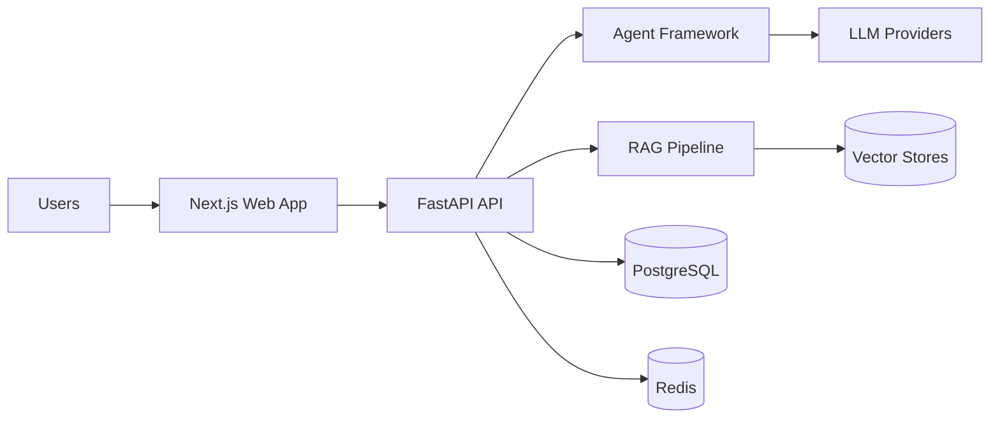

# AgentMason AI Platform

AgentMason AI Platform is an enterprise-grade AI agent framework designed as a foundation for consulting engagements, internal copilots, knowledge assistants, and regulated government technology solutions.

## Highlights

- Clean architecture with domain-driven packages
- Security-first design with JWT auth, RBAC, and API keys
- Multi-provider LLM support via OpenAI, Anthropic, Google Gemini, Azure OpenAI, and Ollama
- RAG pipeline with document ingestion, chunking, embeddings, vector search, and citations
- Prompt management, evaluation, tracing, and observability
- Docker-based deployment and CI/CD workflow

## Architecture



## Quick start

```bash
python3 -m venv .venv
source .venv/bin/activate
pip install -e .
docker compose up -d
uvicorn apps.api.app.main:app --reload --port 8000
```

## Local development

- API: http://localhost:8000/docs
- Web app: http://localhost:3000
- PostgreSQL: localhost:5432
- Redis: localhost:6379

## Deployment

Use Docker Compose for local deployment or Kubernetes manifests in the infra directory for production rollout.
